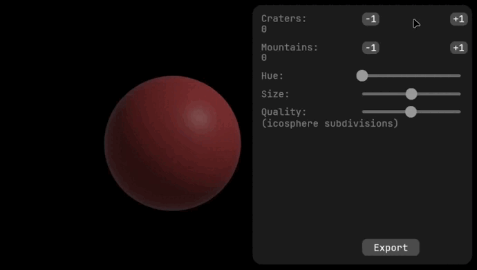
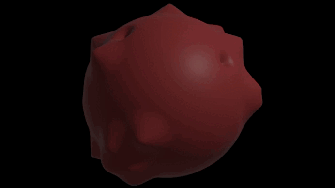

# My Own Planet

Create your very own planet with a variety of options.

Great for 3D printing, game prototypes, or creating just for fun.


## Features  

- Add physical features such as craters and mountains
- Customize the planet's color
- Adjust planet size  
- Control mesh quality  
- Preview changes in real time  
- Export planets as OBJ files *(geometry only; color isn't supported in OBJ files)*

## Creation

This app allows you to create a variety of custom planets using options like crater count, size, and quality.


## Export

Planets can be exported as `.obj` files for use in other applications.

_planet exported into Bambu Studio_

## Building

This project can be downloaded from GitHub and run with:
```bash
git clone https://github.com/looking-g/My-Own-Planet
cd my-own-planet
cargo run --release
```

<!-- itch.io download isn't available yet
## Download

Alternatively, the project can be downloaded at [Itch.io](NO LINK YET)
-->